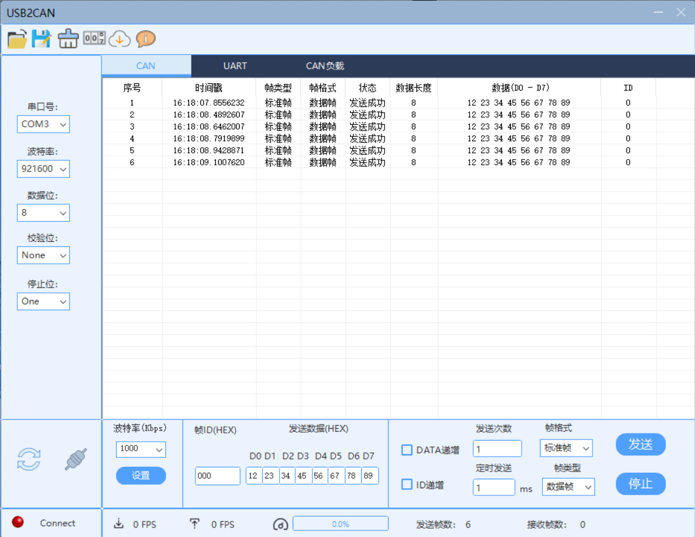
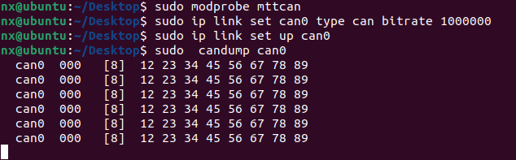

# DM-Orin载板的CAN测试

**示例环境：**

**主机为 Ubuntu 20.04**

#### 测试工具

DM-Orin载板 ，达妙USBCAN分析仪

#### 测试步骤

1.将主机的CAN口和自制CAN收发模块的 CAN_H接CAN_H ，CAN_L接CAN_L


2.激活can

```
sudo modprobe mttcan
```

3.配置can波特率

```
sudo ip link set can0 type can bitrate 1000000
```

4.开启can

```
sudo ip link set up can0
```

5.接收数据：监视can0通道，在控制台上显示接收到的CAN帧。

```
sudo candump can0
```

发送CAN帧







