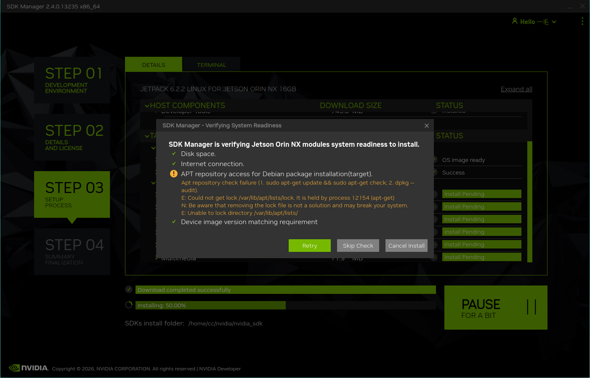
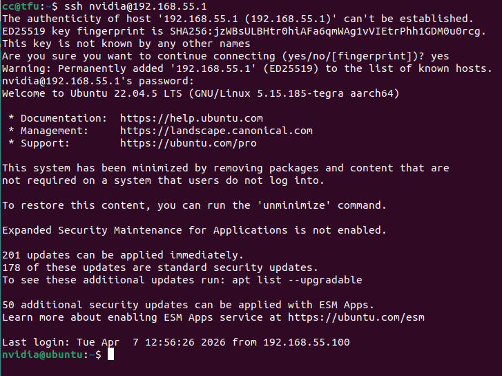
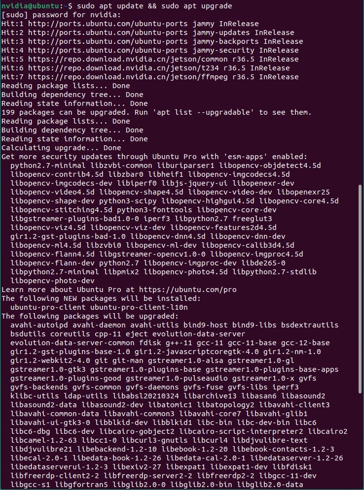
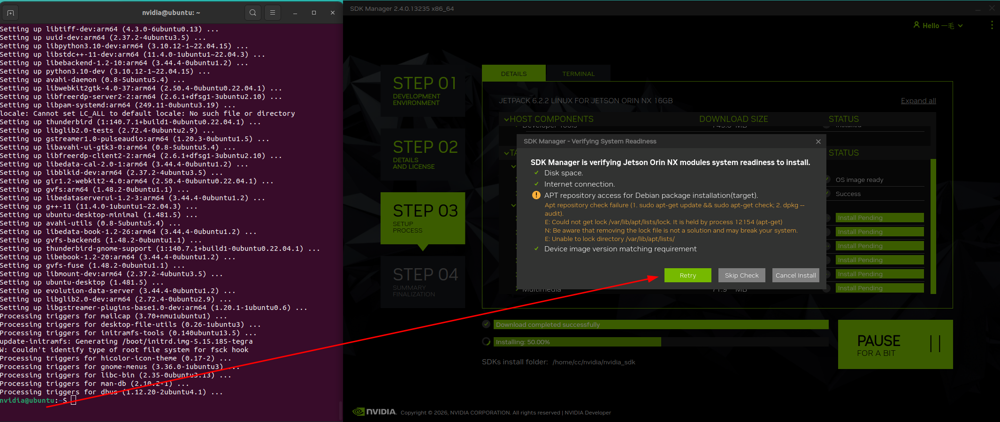
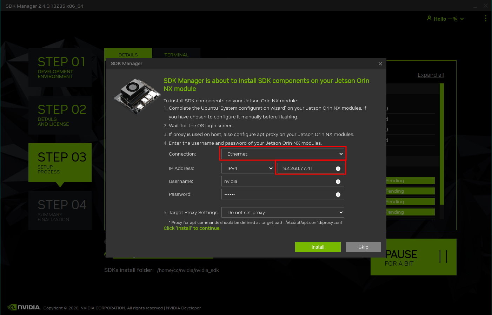

# 安装CUDA组件错误

### 依赖不匹配

*该错误通常需要用具进入到系统内，并更新软件软之后继续安装*



- 登录主机
```bash
ssh nvidia@192.168.55.1
```




- 更新软件依赖
```bash
sudo apt update &&sudo apt upgrade -y
```


- 完成后点击`Retry`重试



### 无法连接到载板的IP地址

*偶发问题，暂未留存故障图例，因此先空出，因为是已知问题，切不好复现，所以先给出解决办法*


- 切换连接方式为Ethernet ，设置IP_v4地址以为你的Orin实际连接的网络ip地址
```bash
# （在Orin上）可通过 ip 工具查看
ifconfig
或
ip a
```



