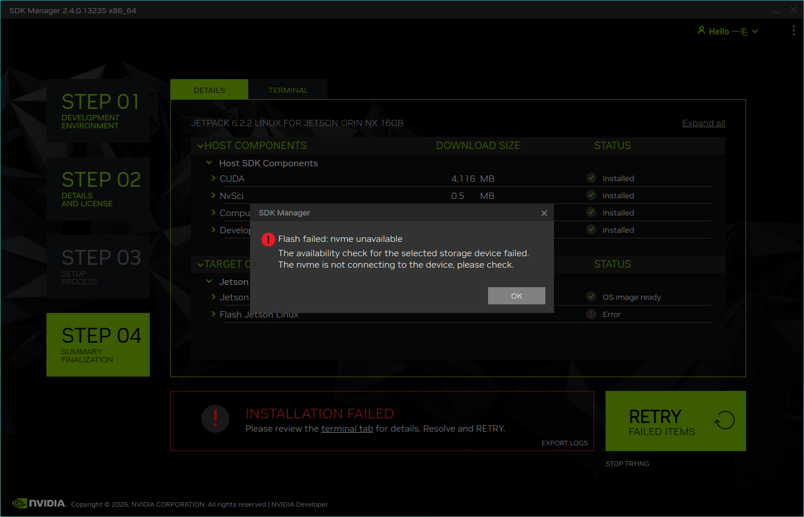

# SSD 状态异常

### 磁盘状态不可用
*此故障通常为明显硬件故障*

- 检查 SSD 是否正确安装，确认是否存在未完全插入、倾斜或松动等情况

- 检查 SSD 金手指是否洁净，必要时可使用无水酒精、洗板水或橡皮擦轻轻擦拭

- 检查 SSD 插槽及周边部件是否完整，注意是否存在以下问题：

    - 插槽针脚弯曲、断裂或缺失

    - 卡槽一端翘起

    - 相邻针脚短路

### 磁盘烧录多数失败，却有几次成功，或一段时间后启动失败

 

> ⚠️ 此问题为偶发性故障，难以复现，暂未留存故障图片,所以先给出解决办法。

*SSD 的存储单元出现磨损或损坏，导致数据写入后无法稳定保存（即“断电记忆”功能失效），或直接的物理坏道。*

- 将 SSD 装入移动硬盘盒，连接至 Windows 系统电脑

- 使用专业磁盘工具（如 DiskGenius）扫描磁盘健康状态，检查各存储通道是否正常

*Download links：https://www.diskgenius.cn*

### 磁盘空间不足

 

> ⚠️ 此问题为偶发性故障，难以复现，暂未留存故障图片,所以先给出解决办法。

*可能的原因：多次烧录操作导致 SSD 上残留多个分区。烧录工具随机选择分区进行写入，当选中容量较小的分区时，即提示空间不足。*

- 将 SSD 装入移动硬盘盒，连接至 Windows 系统电脑

- 检查磁盘是否存在多个分区

- 合并所有分区为一个分区或删除所有分区后重新初始化

- 建议使用磁盘工具一并扫描 SSD 健康状态，以排除潜在的硬件问题。

