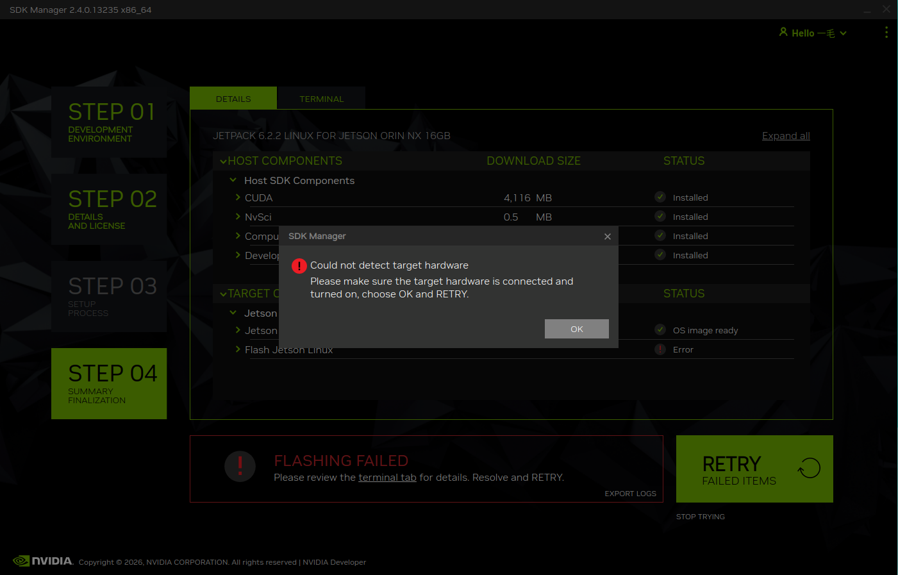
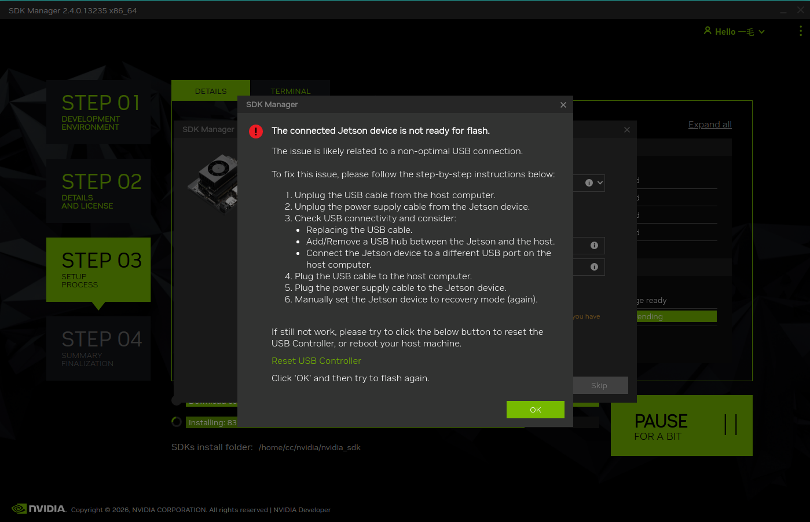

# USB 连接异常

### USB 意外断开

*烧录过程中 USB 连接意外中断，通常由物理连接松动引起。*

- USB 线缆被意外触碰或拉扯

- 连接端口因振动或晃动导致接触不良

- 避免使用劣质 USB 数据线，优先选用原厂或通过认证的线缆

### USB信号不稳定

*在下载过程中USB设备掉线*

- USB 线缆存在物理损伤（如内部断线、屏蔽层破损）

- 请确保您的工作环境稳定，不要再移动中的汽车内或者远离桌面有其他导致震动的物品

- 工作环境存在振动或晃动（如车载环境、不稳定的操作台面）

- USB 端口接触不良或引脚定义不匹配

- 使用低质量或不符合规范的 USB 线缆
