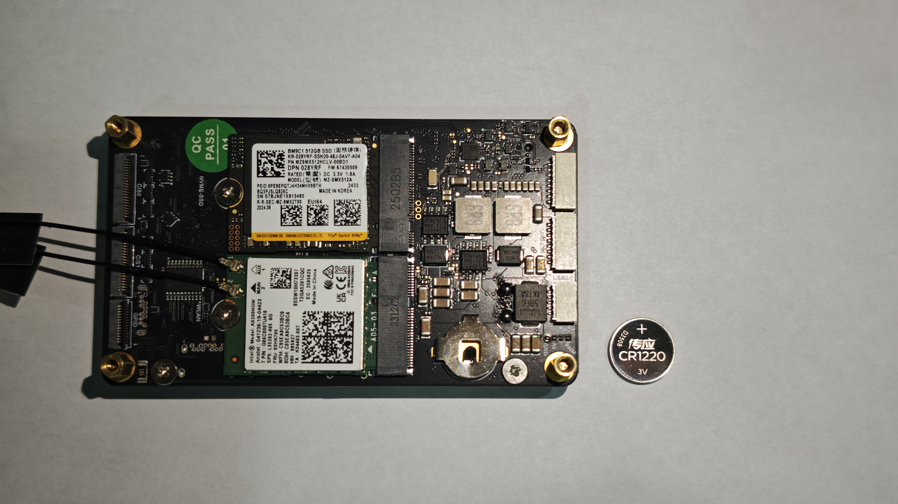
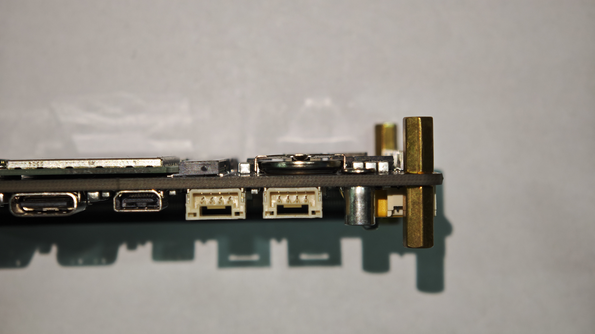
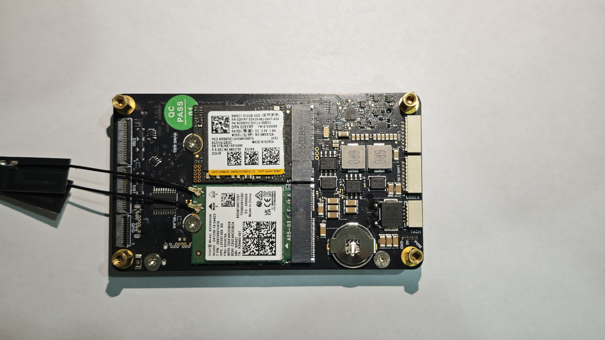

# 达妙载板RTC硬件时钟同步

> 本文档仅供当前问题参考，尚未经过完整测试。内容基于开发工程师在客户问题修复过程中的实践总结。如您对RTC功能有较高可靠性要求，请持续关注后续更新。我们将在完成全面测试后，发布正式文档并为您提供稳定支持。

> RTC（硬件实时时钟）是嵌入式系统主板上的独立硬件计时芯片，由后备电池（通常为CR1220纽扣电池）供电。即使系统主电源断开、关机或重启，RTC依然能持续精确计时，尤其适用于无网络环境。达妙Orin载板已集成RTC硬件时钟功能，并提供完整的技术支持。

### 检查设备支持

- 安装电池

    *请在设备上电前或完全断电后安装RTC电池。请勿在设备通电状态下进行电池插拔操作，以免因热插拔导致Orin载板损坏* 

    - 准备CR1220纽扣电池一枚（电压范围3.0V-3.3V皆可，通常为3.0V）

    

    - 检查CR1220电池和的Orin载板RTC电池座正负极

    *请一定注意：CR1220电池的安装方向请注意区分极性——电池底部（平面端）为正极，顶部（凸起端）为负极。对应载板电池座：外壳侧为正极，PCB侧为负极。请按正确方向安装，避免损坏设备*

    

    - 为Orin载板安装CR1220电池

    *请一定注意：CR1220电池的安装方向请注意区分极性——电池底部（平面端）为正极，顶部（凸起端）为负极。对应载板电池座：外壳侧为正极，PCB侧为负极。请按正确方向安装，避免损坏设备*

    
    


- 检查RTC功能
    - 首先检查RTC设备是否存在

    ``` bash 
    ls -la /dev/rtc*
    ls -la /dev/ | grep rtc 
    ```

    - 检查RTC驱动是否加载

    ``` bash 
    sudo dmesg | grep -i rtc
    lsmod | grep rtc
    ```

    - 查看系统RTC设备

    ``` bash 
    cat /proc/driver/rtc
    ```

- Orin 上通常有两个 RTC：

    - rtc0：由其他电源管理器件支持，可作为掉电保持 RTC
    - rtc1：Tegra SoC 内部 RTC，默认常被设为系统 RTC，但掉电后不能保持时间

NVIDIA 论坛多次明确提到，Orin 默认 RTC 源经常是 rtc1，如果需要“断电后仍保时”，就需要切到 rtc0 (PSEQ_RTC)。官方 FAQ 甚至直接写了：默认 RTC1 (Orin_RTC) 掉电后不能保时，如需掉电保持，需要改到 RTC0 (PSEQ_RTC)。

---


## 使用系统默认服务(推荐)

> NVIDIA Jetson Orin 已原生集成 RTC 功能及配套系统服务，官方方案经过充分测试，具有更高的可靠性与兼容性。因此，强烈建议优先使用系统自带 RTC 服务。如需采用自定义 RTC 方案，请参考下一章节。

- 将当前系统时间写入RTC0

```bash
# 将当前系统时间写入硬件时钟
sudo hwclock -w -f /dev/rtc0
```

- 检查服务和脚本

```bash
# 检查服务和脚本是否存在
ll /etc/systemd/nvrtc-sync-boot.sh
ll /etc/systemd/system/nvrtc-sync-boot.service 

cat /etc/systemd/nvrtc-sync-boot.sh
cat /etc/systemd/system/nvrtc-sync-boot.service
```

- 测试脚本

```bash
sudo bash /etc/systemd/nvrtc-sync-boot.sh

# 如果你没有设置正确的RTC时间，此时你的系统时间会变成1970-01-01 08:48:29.765380+08:00
# 如果你按照之前的时间设置了RTC时间，则此时你的RTC0和RTC1时间一致，为当前系统时间
```

- 测试服务

```bash
# 启动并检查服务状态
sudo systemctl unmask nvrtc-sync-boot.service 
sudo systemctl start nvrtc-sync-boot.service 
sudo systemctl status nvrtc-sync-boot.service 

# 设置服务开机自启动
sudo systemctl enable nvrtc-sync-boot.service 
```

- 重启设备
    - 请先关闭电源
    
    - 移除 USB/PCIE等各种方式集成的有线无线网络以及网络设备

    - 断电后请在等待5-10min之后再次开机

- 检查设备时间

```bash
# 验证RTC时间是否接近真实世界时间
sudo hwclock -r -f /dev/rtc0

# 检查RTC时间是否与系统时间一致
date
```

- 当系统时间同步成功时


---


## 如果您打算自行创建RTC系统服务

> 若您希望保留 NVIDIA Jetson Orin 原生 RTC 功能及配套系统服务的完整性，可采用以下方案进行硬件时钟同步，以最大程度降低对原生系统环境的影响。

### 创建RTC服务

*创建RTC服务可以实现在系统每次启动时自动同步硬件时间*

- 同步系统时间
    - 将系统时间写入RTC

    ``` bash 
    # 将当前系统时间写入硬件时钟
    sudo hwclock -w -f /dev/rtc0
    ```

    - 检查RTC时间

    ``` bash 
    # 验证RTC时间是否更新
    sudo hwclock -r -f /dev/rtc0

    # 检查RTC时间是否与系统时间一致
    date
    ```
    
- 创建RTC时间同步脚本

    - 创建脚本

    ``` bash 
    # 在 `/usr/local/` 创建 `orin_board_rtc/` 文件夹来存放脚本
    sudo mkdir -p /usr/local/orin_board_rtc/

    # 创建脚本 `update_rtc_time.sh` 
    sudo touch /usr/local/orin_board_rtc/update_rtc_time.sh

    # 使用 vim 编辑脚本
    sudo vim /usr/local/orin_board_rtc/update_rtc_time.sh
    ```

    - 编辑脚本

    *行末的空行很重要，请注意保留格式*

    ``` bash 
    #!/bin/bash

    # 检查并自动获取 root 权限
    if [ "$(id -u)" -ne 0 ]; then
        echo "需要 root 权限，自动提权..."
        exec sudo /bin/bash "$0" "$@"
        exit 1
    fi

    # 同步 RTC 时间到系统
    /sbin/hwclock -s

    # 显示结果
    echo "系统时间已更新为：$(date)"
    echo "RTC硬件时间为：$(/sbin/hwclock -r)"

    ```

    - 测试脚本

    ``` bash 
    # 给脚本最高权限
    sudo chmod -R 777 /usr/local/orin_board_rtc/update_rtc_time.sh

    # 测试脚本
    bash /usr/local/orin_board_rtc/update_rtc_time.sh
    ```

- 创建RTC自启动服务

    - 创建服务

    ``` bash 
    # 在 `/etc/systemd/system/` 创建 `orin_board_rtc.service` 服务 
    sudo touch /etc/systemd/system/orin_board_rtc.service

    # 使用 vim 编辑脚本
    sudo vim /etc/systemd/system/orin_board_rtc.service
    ```

    - 编辑服务脚本

    *行末的空行很重要，请注意保留格式*

    ``` bash 
    [Unit]
    Description=damiao_orin_board_rtc
    After=local-fs.target

    [Service]
    Type=oneshot
    ExecStart=/usr/local/orin_board_rtc/update_rtc_time.sh
    RemainAfterExit=yes
    StandardOutput=journal

    [Install]
    WantedBy=multi-user.target

    ```

    - 测试服务

    ``` bash 
    # 重新加载systemd
    sudo systemctl daemon-reload

    # 启动服务
    sudo systemctl start orin_board_rtc.service
    ```

### 启用RTC服务

- 重新加载systemd

```bash 
sudo systemctl daemon-reload
```

- 禁用 Nvidia 自带的RTC服务 

```bash
sudo systemctl stop nvrtc-sync-boot.service 
sudo systemctl disable nvrtc-sync-boot.service  
sudo systemctl mask nvrtc-sync-boot.service 
```

- 启用orin_board_rtc.service服务

```bash 
sudo systemctl start orin_board_rtc.service
```

- 检查orin_board_rtc.service状态

```bash 
sudo systemctl status orin_board_rtc.service
```


### 结束语

- 至此，您的Orin载板RTC硬件时钟同步配置已基本完成。通过上述步骤，您应该能够成功实现断电后时间保持功能。

- 如果您在使用中遇到问题，欢迎在gitee提交议题，我们会第一时间为您处理，请留意您的议题处理进度。

    - 请先在 Gitee 平台搜索是否有相似议题，避免重复提交

    - 若未找到解决方案，欢迎在 Gitee 提交新议题，我们会第一时间为您处理 
	
    - 请留意您的议题处理进度，以便及时跟进反馈

- 感谢您使用达妙科技产品，祝您生活、工作愉快！