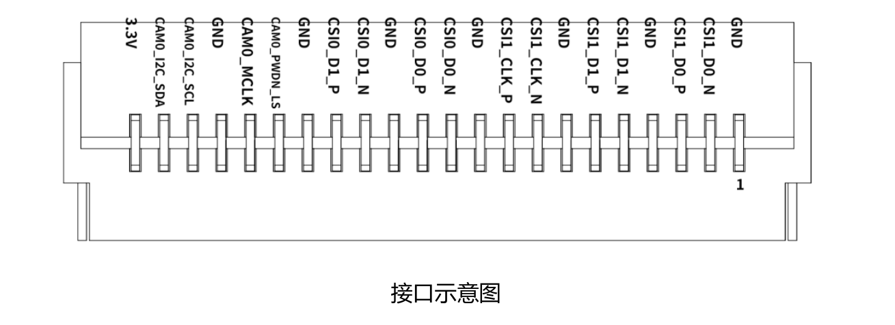
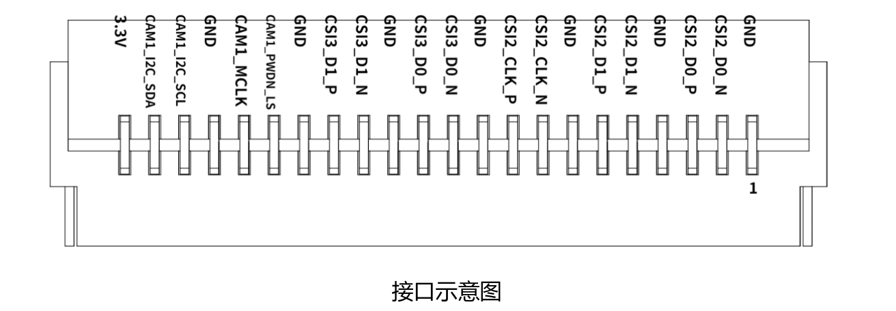
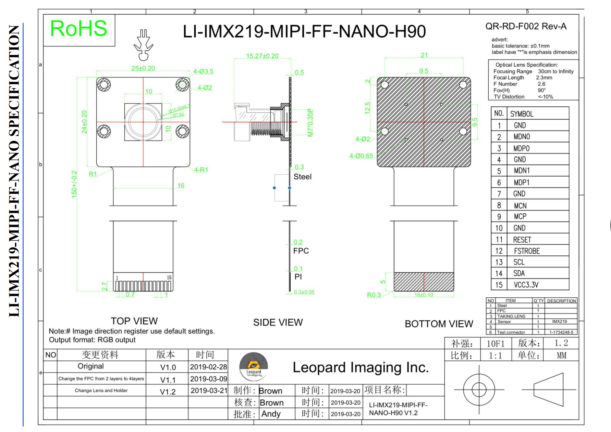
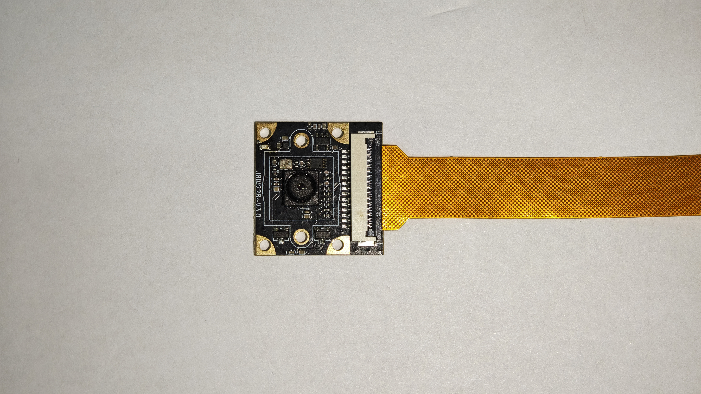
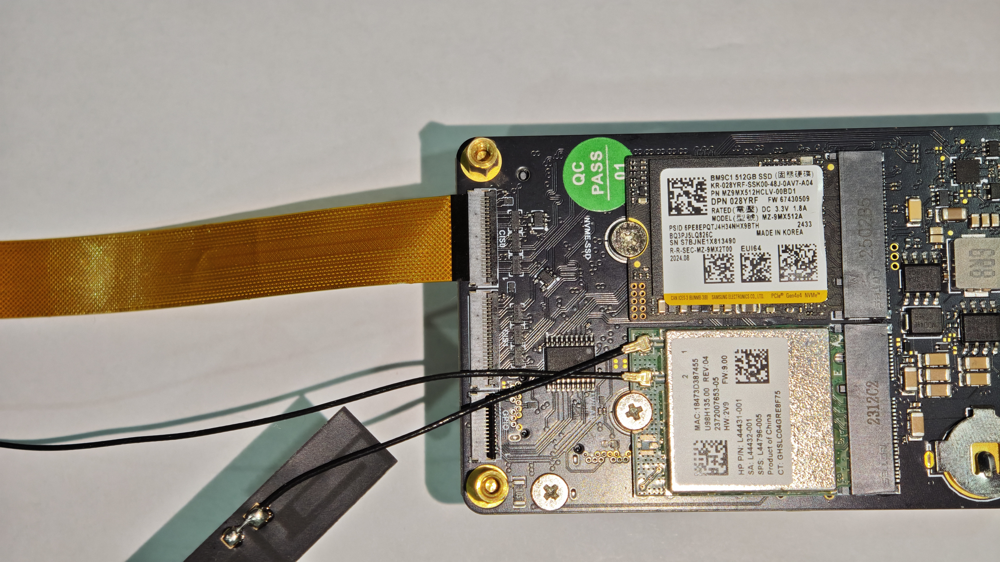
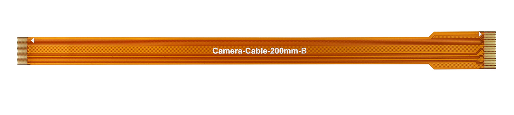
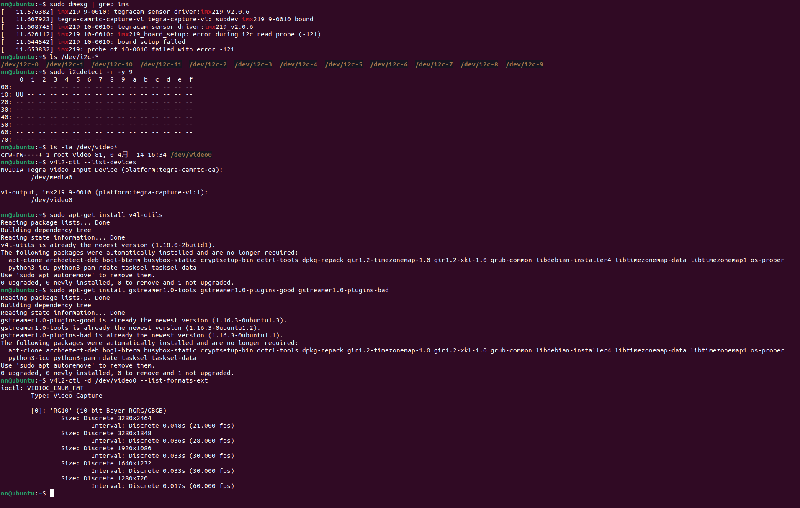
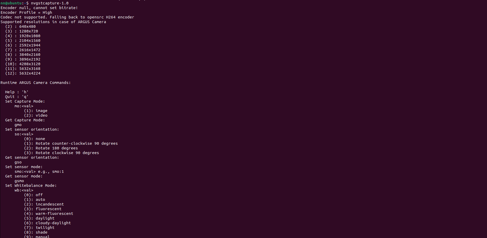
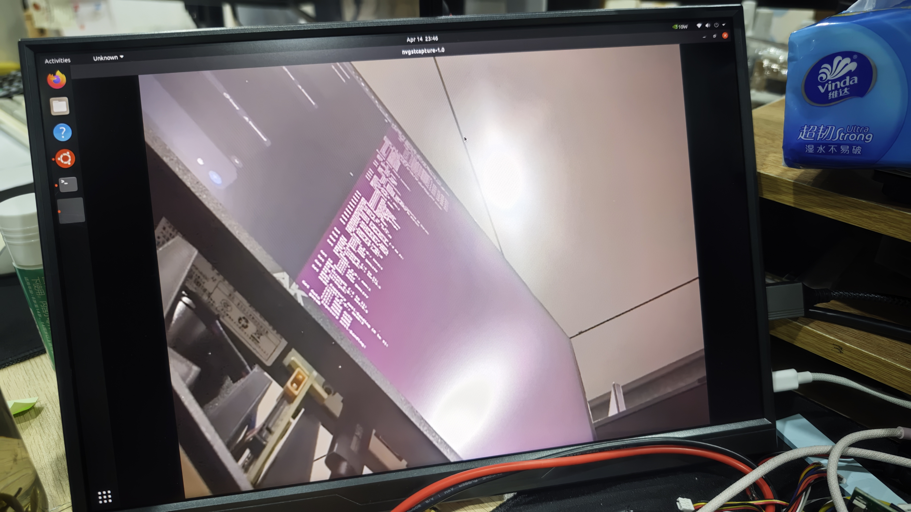

# 达妙Orin 系列载板 CSI 相机适配和使用方法

> 当前Jetson官方驱动仅原生支持IMX219传感器。建议优先选择此型号模组，通常15-pin FPC接口的IMX219相机均可正常工作。

### 引脚明细

- CSI0

| 接口引脚 | 引脚信号 | 模组引脚 | 类型 |
|---|---|---|---|
| 1  | GND         | --  | 电源 |
| 2  | CSI1_D0_N   | 3   | CIS 差分 |
| 3  | CSI1_D0_P   | 5   | CIS 差分 |
| 4  | GND         | --  | 电源 |
| 5  | CSI1_D1_N   | 15  | CIS 差分 |
| 6  | CSI1_D1_P   | 17  | CIS 差分 |
| 7  | GND         | --  | 电源 |
| 8  | CSI1_CLK_N  | 9   | CIS 差分 |
| 9  | CSI1_CLK_P  | 11  | CIS 差分 |
| 10 | GND         | --  | 电源 |
| 11 | CSI0_D0_N   | 4   | CIS 差分 |
| 12 | CSI0_D0_P   | 6   | CIS 差分 |
| 13 | GND         | --  | 电源 |
| 14 | CSI0_D1_N   | 16  | CIS 差分 |
| 15 | CSI0_D1_P   | 18  | CIS 差分 |
| 16 | GND         | --  | 电源 |
| 17 | CAM0_PWDN_LS| 114 | CMOS1.8 输出 |
| 18 | CAM0_MCLK   | 116 | CMOS1.8 输出 |
| 19 | GND         | --  | 电源 |
| 20 | CAM0_I2C_SCL| *   | 开漏 3.3V |
| 21 | CAM0_I2C_SDA| *   | 开漏 3.3V |
| 22 | 3.3V        | --  | 电源 |

*注：此部分电路与原版相同，IIC 由 CAM_I2C_SDA（215）、CAM_I2C_SCL（213）经由 CAM_MUX_SEL（130）切换而来*




- CSI1

| 接口引脚 | 引脚信号 | 模组引脚 | 类型 |
|---|---|---|---|
| 1  | GND          | --  | 电源 |
| 2  | CSI2_D0_N    | 22  | CIS 差分 |
| 3  | CSI2_D0_P    | 24  | CIS 差分 |
| 4  | GND          | --  | 电源 |
| 5  | CSI2_D1_N    | 34  | CIS 差分 |
| 6  | CSI2_D1_P    | 36  | CIS 差分 |
| 7  | GND          | --  | 电源 |
| 8  | CSI2_CLK_N   | 28  | CIS 差分 |
| 9  | CSI2_CLK_P   | 30  | CIS 差分 |
| 10 | GND          | --  | 电源 |
| 11 | CSI3_D0_N    | 21  | CIS 差分 |
| 12 | CSI3_D0_P    | 23  | CIS 差分 |
| 13 | GND          | --  | 电源 |
| 14 | CSI3_D1_N    | 33  | CIS 差分 |
| 15 | CSI3_D1_P    | 35  | CIS 差分 |
| 16 | GND          | --  | 电源 |
| 17 | CAM1_PWDN_LS | 120 | CMOS1.8 输出 |
| 18 | CAM1_MCLK    | 122 | CMOS1.8 输出 |
| 19 | GND          | --  | 电源 |
| 20 | CAM1_I2C_SCL | *   | 开漏 3.3V |
| 21 | CAM1_I2C_SDA | *   | 开漏 3.3V |
| 22 | 3.3V         | --  | 电源 |

*注：此部分电路与原版相同，IIC 由 CAM_I2C_SDA（215）、CAM_I2C_SCL（213）经由 CAM_MUX_SEL（130）切换而来*




- IMX29 Pin assignment

| No. | Name   | Pin type | Description |
|---|---|---|---|
| 1  | GND     | Ground |  |
| 2  | MDN0    | O      | MIPI data positive output |
| 3  | MDP0    | O      | MIPI data negative output |
| 4  | GND     | Ground |  |
| 5  | MDN1    | O      | MIPI data positive output |
| 6  | MDP1    | O      | MIPI data negative output |
| 7  | GND     | Ground |  |
| 8  | MCN     | O      | MIPI clock negative output |
| 9  | MCP     | O      | MIPI clock positive output |
| 10 | GND     | Ground |  |
| 11 | RESET   | I      | Reset |
| 12 | FSTROBE | O      | Strobe output |
| 13 | SCL     | I      |  |
| 14 | SDA     | I/O    |  |
| 15 | VCC3.3V | Power  |  |

*下图展示了标准15-pin CSI模组的接口定义，该图引自IMX219模组规格书（来源：[SparkFun](https://cdn.sparkfun.com/assets/0/b/0/e/d/LI-IMX219-MIPI-FF-NANO_SPEC.pdf)）。本方案所选用的相机模组与此接口定义完全一致，可直接参照此图进行硬件连接*


<!-- [](https://cdn.sparkfun.com/assets/0/b/0/e/d/LI-IMX219-MIPI-FF-NANO_SPEC.pdf) -->
<!--  -->


### 为Orin载板连接IMX219相机





- 准备一条 15-pin 转 22-pin 的 FPC 排线（如下图所示），用于连接相机模组与 Orin 载板。



- 请务必核对排线的 VCC 与 GND 引脚顺序

    - 达妙 Orin 载板的 CSI 接口：1 号引脚为 GND

    - IMX219 相机模组：1 号引脚同样为 GND

- 达妙在Orin载板的CSI接口支持正反两个顺序，您可以检查您的实际线序来调整链接方式，但确保不能接反否则会导致相机模组、载板甚至核心板烧毁，无法修复！


### 配置相机

- 检查相机是否存在

```bash
# 检查相机是否被系统识别
sudo dmesg | grep imx
```

- 确认 I2C 地址并扫描

```bash
# 查看所有 I2C 总线
ls /dev/i2c-*

# 扫描某条总线，例如 i2c-9
sudo i2cdetect -r -y 9
```

- 查看系统识别到了哪些摄像头设备

```bash
ls -la /dev/video*
v4l2-ctl --list-devices
```

- 安装必要的工具

```bash
# 安装 v4l-utils（包含 v4l2-ctl 命令）
sudo apt-get update
sudo apt-get install v4l-utils

# 同时安装 GStreamer 工具（用于预览和录制）
sudo apt-get install gstreamer1.0-tools gstreamer1.0-plugins-good gstreamer1.0-plugins-bad
```

-  查看相机支持的格式和分辨率

```bash
v4l2-ctl -d /dev/video0 --list-formats-ext
```



### 使用 nvgstcapture-1.0 捕获画面

- 基本预览和拍照

```bash
# 打开预览窗口（按 J 拍照，按 Q 退出）
nvgstcapture-1.0
```


## nvgstcapture-1.0 常用快捷键

```bash
# 打开预览窗口（按 J 拍照，按 Q 退出）
nvgstcapture-1.0
```



| 按键 | 功能 |
|------|------|
| J | 拍照并保存 |
| Q | 退出程序 |
| 空格 | 开始/停止录像 |
| + / - | 缩放 |
| ] / [ | 调节亮度 |



***上图显示的是 nvgstcapture-1.0 成功运行后的实时预览画面。若能看到清晰的动态图像，说明：IMX219 相机硬件连接正常； 驱动加载成功； 图像采集链路工作正常***


### 结束语

- 至此，您的 IMX219 相机配置工作已基本完成。通过上述步骤，您应该能够成功识别相机并捕获实时画面。

- 如果您在使用中遇到问题，欢迎在gitee提交议题，我们会第一时间为您处理，请留意您的议题处理进度。

    - 请先在 Gitee 平台搜索是否有相似议题，避免重复提交

    - 若未找到解决方案，欢迎在 Gitee 提交新议题，我们会第一时间为您处理 
	
    - 请留意您的议题处理进度，以便及时跟进反馈

- 感谢您使用达妙科技产品，祝您生活、工作愉快！


