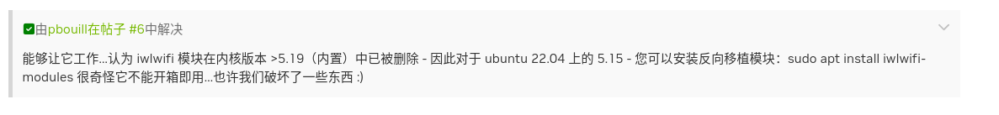

# 在Ubuntu22.04安装Intel_Wifi模组驱动
> 参考：[https://forums.developer.nvidia.com/t/issue-with-intel-wireless-8265-8275-network-card-on-ubuntu-22-04/279938](https://forums.developer.nvidia.com/t/issue-with-intel-wireless-8265-8275-network-card-on-ubuntu-22-04/279938)

原因分析：大致意思为，linux6.0的系统不支持该网卡，不过可以使用反向编译的方法，使其正常使用，但他不可以开机快速启动，需要等待一些时间



> 以下方法大致适用于Intel全系列网卡，但达妙智控目前验证过的网卡包括：Intel 8265NGW、Intel AX200、intel AX210  
如果您强烈需要免驱的网卡建议采购：AW-CB375NF(原厂)/RTL8822CE（相同芯片组）、RTL8852BE、MT7921 / MT7922 这些网卡都支持原生内核免驱并且目前看起来不会因为内核的更新而失去这部分驱动

### 检查网卡是否存在
```bash
lspci | grep -i network
```


### 检查驱动是否存在
```bash
# 检查linux-firmware已经存在的固件
ls /lib/firmware | grep iwlwifi

# 查看驱动是否存在
modinfo iwlwifi

# 尝试加载模块（如果有的话，但是通常不会）
sudo modprobe iwlwifi

```


**这里看起来是没有对应的驱动的**


### 驱动修复
> 下面我将提供两种方式解决这个问题
1. 您的设备可以有条件访问网络（最推荐）

* 有线网卡接入、USB无线网卡接入或其他形式的上网条件
```bash
# 更新软件列表和安装最新的系统依赖
sudo apt update && sudo apt upgrade -y
# 在线方式安装iwlwifi驱动
sudo apt install iwlwifi-modules
```

2. 你的工作环境无法提供网络支持是可使用该方法（不推荐）
* 该方法当前只是适用于Ubuntu22.04镜像，其他版本请先自行处理，并及时在客户支持群或者gitee中添加议题，我们看到后会第一时间为您处理！
* 该方法是通过 `apt-rdepends` 方式获取完整依赖树，这个操作我们已经帮您完成了，您只需要按找下面的方法进行安装即可，离线安装可能会有依赖冲突，请您仔细阅读如下操作说明
```bash
# 解压缩安装包文件夹
tar -xjvf dependency_packages.tar.bz2

# 给文件可执行权限
sudo chmod -R +x install_iwlwifi.sh

# 您必须使用 sudo 权限来使用此脚本
sudo ./install_iwlwifi.sh
```
* 如果你你在安装脚本执行过程中他遇到了某些错误自行退出，或者其他报错，请执行
```bash
sudo apt --fix-broken install

# 或等价的最简单命令
sudo apt install -f
``` 

### 检查驱动是否存在并加载驱动
```bash
sudo modinfo iwlwifi
sudo modprobe iwlwifi
```


**完成上述工作后需要重启电脑**

