# Device_tree_for_ubuntu20.04 <==>  适用于 Ubuntu 20.04 的设备树文件

> damiao_orin_borad是达妙科技研发的第三方载板，截止目前共有v1.0, v1.1 ,v2.1 三个版本。适用于Nvidia Jetson Orin_NX\Orin_Nano系列核心板
> 在使用过程中,会发现载板的USB2(Type-C)接口默认为挂在在usb2.0的总线上，而导致性能损失；另外，我们也会发现载板的UART 0 设备无法使用。下面我们一起来解决这个问题

### 下载Nvidia Jetson源码

> 下载链接:https://developer.nvidia.com/embedded/jetson-linux-r3564

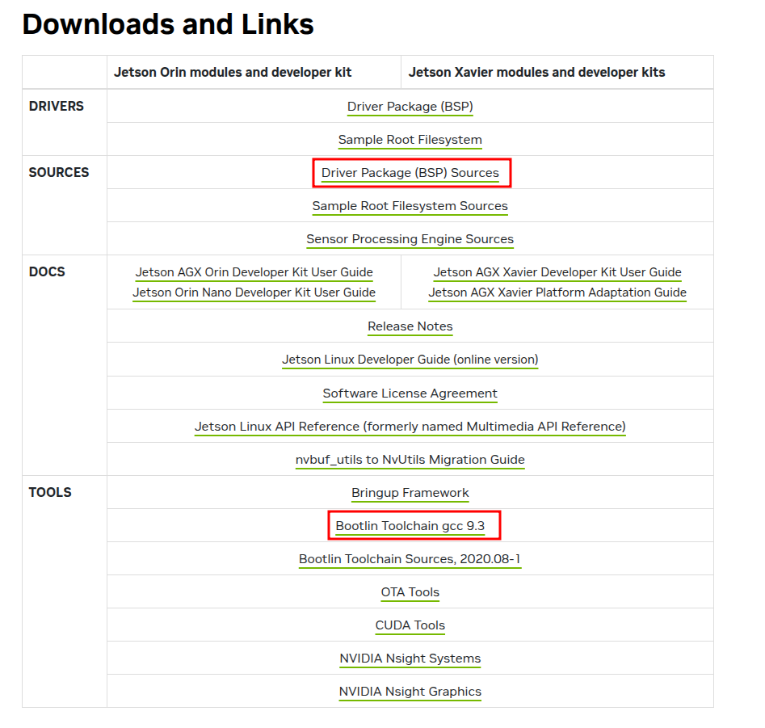

1. 分别下载BSP源码和编译工具链

- 下载 `Driver Package (BSP) Sources` 得到 `public_sources.tbz2`

- 下载 `Bootlin Toolchain gcc 9.3 ` 得到 `aarch64--glibc--stable-final.tar.gz`

2. 构建编译环境

```bash
mkdir -p jetson_linxu_35.6.4
cd jetson_linxu_35.6.4

# 将你下载的文件添加到当前目录里
# 一定要将下面的`you_download_folder`你的实际下载目录，请不要完全照抄
cp -r ~/you_download_folder/public_sources.tbz2 .
cp -r ~/you_download_folder/aarch64--glibc--stable-final.tar.gz .

# 解压缩这内核文件
tar -xjvf public_sources.tbz2

# 解压缩编译工具
mkdir -p aarch64--glibc--stable-final
tar -zxvf aarch64--glibc--stable-final.tar.gz -C aarch64--glibc--stable-final
```

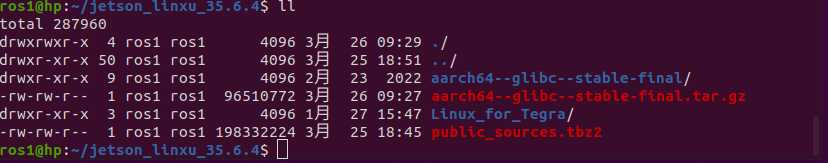


2. 解压缩源码部分

```bash
cd you_kernel_ws/Linux_for_Tegra/source/public/

# 可解压下面的三个主要组件，很重要缺一不可
tar -xjvf kernel_src.tbz2

```

|   |   |
|---|---|
|`kernel_src.tbz2`|Linux 内核主线源码|


### 添加构建工具链接和环境变量

1. 根据操作平台选择下载对应的编译工具链

```bash
# 在amd（x86）主机上操作时下载工具 
sudo apt-get install device-tree-compiler 
# Jetson板卡上操作时下载工具
sudo apt install tegra-21x-dt   
sudo apt-get install libssl-dev         
```

2. 在当前终端添加编译工具链接
```bash
# 切换目录到you_kernel_ws
cd ~/jetson_linxu_35.6.4/Linux_for_Tegra/source/public/kernel/kernel-5.10

# 一定要将下面的`you_kernel_ws`你的实际下载目录，请不要完全照抄
# 首先设置 JETPACK 路径
export JETPACK=~/jetson_linxu_35.6.4/Linux_for_Tegra

# 然后设置输出目录（使用 JETPACK 变量）
export KERNEL_OUT=$JETPACK/../images
export KERNEL_MODULES_OUT=$JETPACK/../images/modules

# 验证路径是否正确
echo $KERNEL_OUT
# 应该显示: ~/jetson_linxu_35.6.4/Linux_for_Tegra/../images

# 创建输出目录
mkdir -p $KERNEL_OUT
mkdir -p $KERNEL_MODULES_OUT

# 确认交叉编译器路径
export CROSS_COMPILE=~/jetson_linxu_35.6.4/aarch64--glibc--stable-final/bin/aarch64-buildroot-linux-gnu-

# 验证交叉编译器
${CROSS_COMPILE}gcc --version
```

*例如：*

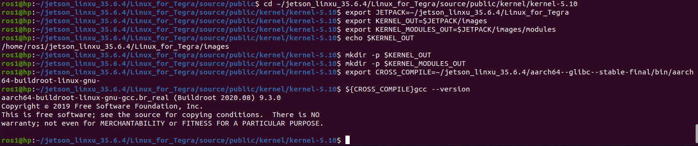


### 修改设备树
1. 修改串口部分

    **在`you_kernel_ws/Linux_for_Tegra/source/public/hardware/nvidia/platform/t23x/p3768/kernel-dts/cvb/tegra234-p3768-0000-a0.dtsi`中修改以下部分**

- 在`serial@3100000`节点后面添加 `serial@3110000` 部分并使能串口
```c
	mttcan@c310000 {
		status = "okay";
	};

	serial@3100000 {/* UARTA, for 40 pin header */
		status = "okay";
	};

	/* 添加串口 UART1 对应 载板物理编号 UART0 */
	serial@3110000 {/* Enable UART1 */
		status = "okay";
	};

	serial@3140000 {
		/* UARTE, Goes to M2.E and also some of the pins to bootstrap */
		status = "okay";
	};
```

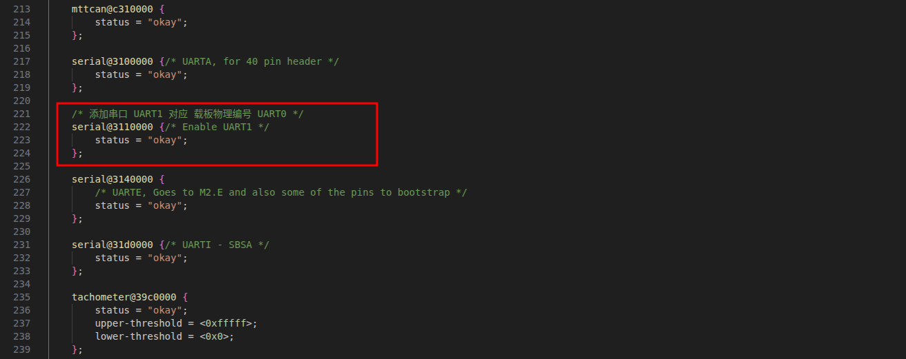


2. 修改USB3.0部分
	**在`you_kernel_ws/Linux_for_Tegra/source/public/hardware/nvidia/platform/t23x/p3768/kernel-dts/cvb/tegra234-p3768-0000-a0.dtsi`中修改以下部分**	

- 在`xusb_padctl: xusb_padctl@3520000 --> pads --> usb3 --> lanes`下添加 `usb3-2`部分，添加第三个 USB 3.0的通道配置
```c
			usb3 {
				lanes {
					usb3-0 {
						nvidia,function = "xusb";
						status = "okay";
					};
					usb3-1 {
						nvidia,function = "xusb";
						status = "okay";
					};
					/* 添加USB2物理层（PHY）的 lane 配置*/
					usb3-2 {	// 第三个 USB 3.0 通道
						nvidia,function = "xusb";
						status = "okay";
					};
				};
			};
```

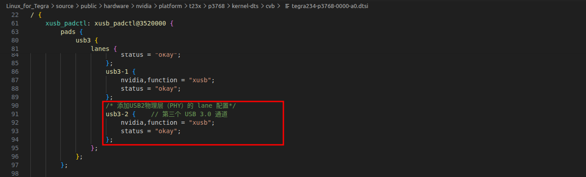

- 在`xusb_padctl: xusb_padctl@3520000 --> ports`下添加 `usb3-2`部分，激活第三个 USB 3.0 端口

```c
		ports {
			usb2-0 {/* Goes to recovery port */
				mode = "otg";
				status = "okay";
				vbus-supply = <&p3768_vdd_5v_sys>;
				usb-role-switch;
				port {
					typec_p0: endpoint {
						remote-endpoint = <&fusb_p0>;
					};
				};
			};
			usb2-1 {/* Goes to hub */
				mode = "host";
				vbus-supply = <&p3768_vdd_av10_hub>;
				status = "okay";
			};
			usb2-2 {/* Goes to M2.E */
				mode = "host";
				vbus-supply = <&p3768_vdd_5v_sys>;
				status = "okay";
			};
			usb3-0 {/* Goes to hub */
				nvidia,usb2-companion = <1>;
				status = "okay";
			};
			usb3-1 {/* Goes to J5 */
				nvidia,usb2-companion = <0>;
				status = "okay";
			};
			usb3-2 {/* 添加usb3-2部分使能 USB3.0 */
				nvidia,usb2-companion = <2>;		// "2"为配对标识符 表示：usb3-2 通道与 usb2-2 通道配对
				status = "okay";
			};
		};
```

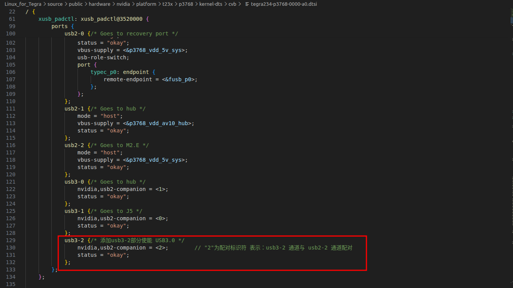

- 将添加启用的硬件通道连接到USB控制器

```c
	tegra_xhci: xhci@3610000 {
		status = "okay";
		phys = <&{/xusb_padctl@3520000/pads/usb2/lanes/usb2-0}>,
			<&{/xusb_padctl@3520000/pads/usb2/lanes/usb2-1}>,
			<&{/xusb_padctl@3520000/pads/usb2/lanes/usb2-2}>,
			<&{/xusb_padctl@3520000/pads/usb3/lanes/usb3-0}>,
			<&{/xusb_padctl@3520000/pads/usb3/lanes/usb3-1}>,
			<&{/xusb_padctl@3520000/pads/usb3/lanes/usb3-2}>;		//添加这一行将将 usb3-2 挂载到 usb3.0 总线上
		phy-names = "usb2-0", "usb2-1", "usb2-2", "usb3-0", "usb3-1", "usb3-2";		// 添加 usb3-2 将usb3-2 在总线上标记为 usb3-2 供驱动内部使用
		nvidia,xusb-padctl = <&xusb_padctl>;
	};
```
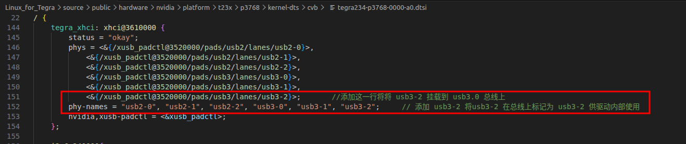

### 编译内核与设备数

1. 编译内核
```bash
# 进入Linux_for_Tegra/source/public/kernel/kernel-5.10
cd ~/you_kernel_ws/Linux_for_Tegra/source/public/kernel/kernel-5.10

# 设置所有环境变量
export JETPACK=~/jetson_linxu_35.6.4/Linux_for_Tegra
export KERNEL_OUT=$JETPACK/../images
export KERNEL_MODULES_OUT=$JETPACK/../images/modules
export CROSS_COMPILE=~/jetson_linxu_35.6.4/aarch64--glibc--stable-final/bin/aarch64-buildroot-linux-gnu-

# 配置内核
make ARCH=arm64 O=$KERNEL_OUT tegra_defconfig
```
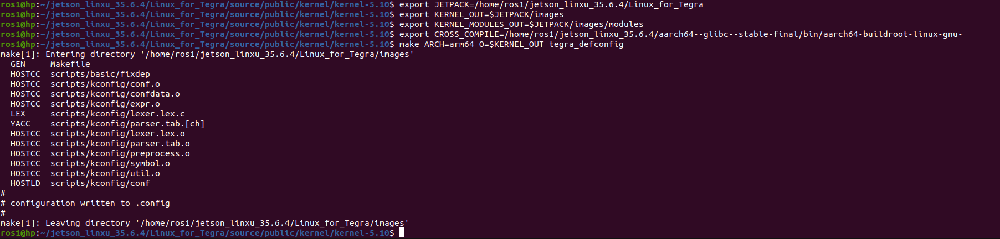

2. 编译设备树
```bash
# 设置所有环境变量
# export JETPACK=~/jetson_linxu_35.6.4/Linux_for_Tegra
# export KERNEL_OUT=$JETPACK/../images
# export KERNEL_MODULES_OUT=$JETPACK/../images/modules
# export CROSS_COMPILE=~/jetson_linxu_35.6.4/aarch64--glibc--stable-final/bin/aarch64-buildroot-linux-gnu-

# 编译设备树
make ARCH=arm64 O=$KERNEL_OUT CROSS_COMPILE=$CROSS_COMPILE -j$(nproc) dtbs
```

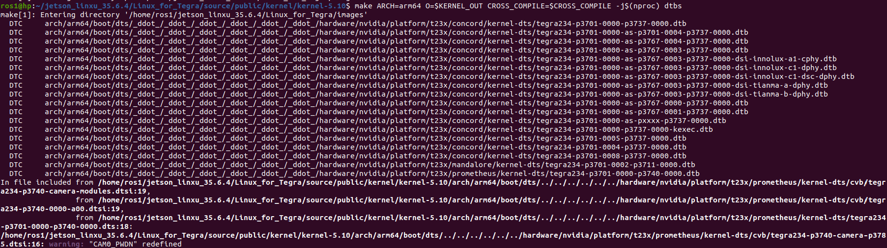

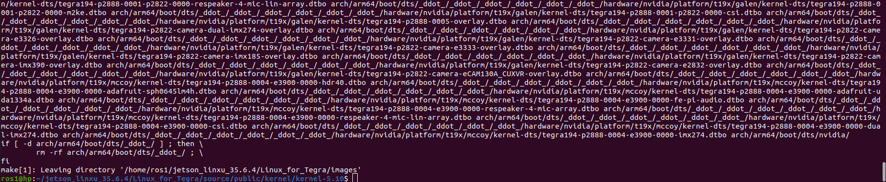

4. 检查生成的设备树文件
- 通常生成的设备树文件位于`Linux_for_Tegra/../images/arch/arm64/boot/dts/nvidia`

```bash
cd ~/jetson_linxu_35.6.4/Linux_for_Tegra

ls /../images/arch/arm64/boot/dts/nvidia/
```
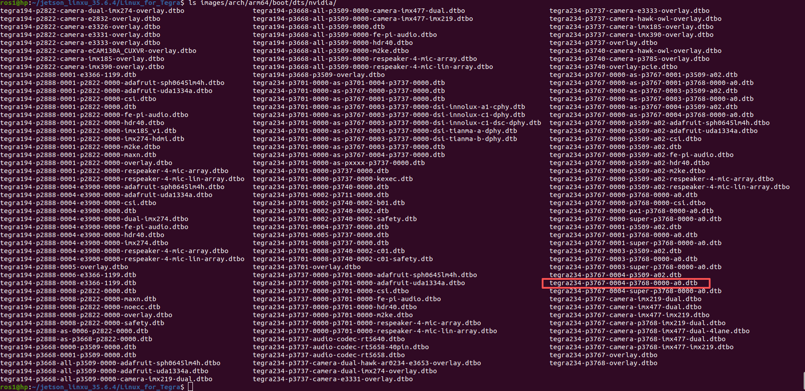


### 为在板替换设备树并引导内核启动时加载的设备树

1. 为Jetson Orin板卡替换设备树
- 在X86主机上将生成的`.dtb`文件上传到Jetson Orin板卡上
```bash
# 使用 ssh 发送设备树文件到Orin板卡上
scp -r ~/you_kernel_ws/tegra234-p3767-0004-p3768-0000-a0.dtb ssh ubuntu@example.com：~/
```

- 在Orin板卡上将得到的文件复制到`/boot/dtb/`下
```bash
sudo cp -r ~/tegra234-p3767-0004-p3768-0000-a0.dtb /boot/dtb/
ls /boot/dtb/

```

2. 手动指定引导加载程序（U-Boot）在启动内核时使用的设备树文件（.dtb）的路径
- 在Jetson Orin 板卡的`/boot/extlinux/extlinux.conf`中添加如下内容

```bash
TIMEOUT 30
DEFAULT primary

MENU TITLE L4T boot options

LABEL primary
      MENU LABEL primary kernel
      LINUX /boot/Image
	  # 增加下面这行，指定对应的dtb文件，文件名称根据你实际情况修改，可以 ls /boot/dtb 查看
      # FDT /boot/dtb/kernel_tegra234-p3767-0004-p3768-0000-a0.dtb
      FDT /boot/dtb/tegra234-p3767-0004-p3768-0000-a0.dtb
      INITRD /boot/initrd
      APPEND ${cbootargs} root=PARTUUID=86c7e189-9e6e-41da-9d89-02ee429594d4 rw rootwait rootfstype=ext4 mminit_loglevel=4 console=ttyTCU0,115200 console=ttyAMA0,115200 firmware_class.path=/etc/firmware fbcon=map:0 net.ifnames=0 nv-auto-config

# When testing a custom kernel, it is recommended that you create a backup of
# the original kernel and add a new entry to this file so that the device can
# fallback to the original kernel. To do this:
#
# 1, Make a backup of the original kernel
#      sudo cp /boot/Image /boot/Image.backup
#
# 2, Copy your custom kernel into /boot/Image
#
# 3, Uncomment below menu setting lines for the original kernel
#
# 4, Reboot

# LABEL backup
#    MENU LABEL backup kernel
#    LINUX /boot/Image.backup
#    FDT /boot/dtb/kernel_tegra234-p3767-0004-p3768-0000-a0.dtb
#    INITRD /boot/initrd
#    APPEND ${cbootargs}

```
3. 完成上述操作后重启Jetson Orin板卡

### 测试USB和串口是否使能
- 插入一个速率(>=)USB3.0 的设备，并在命令行中检查`lsusb -t`的输出结果
```bash
lsusb 
lsusb -t
```
- 检查全部串口是否列出

```bash
# 是否列出/ttyTHS1 (这是我们使能的串口)
ls /dev/ttyTHS*
```

```log
nn@ubuntu:~$ lsusb 
Bus 002 Device 009: ID 30de:6544 KIOXIA TransMemory     # 识别到USB3Gen2的移动存储单元
Bus 002 Device 007: ID 05e3:0625 Genesys Logic, Inc. USB3.2 Hub
Bus 002 Device 001: ID 1d6b:0003 Linux Foundation 3.0 root hub
Bus 001 Device 005: ID 8087:0a2b Intel Corp. Bluetooth wireless interface
Bus 001 Device 015: ID 05e3:0610 Genesys Logic, Inc. Hub
Bus 001 Device 006: ID 046d:c52b Logitech, Inc. Unifying Receiver
Bus 001 Device 003: ID 1a40:0101 Terminus Technology Inc. Hub
Bus 001 Device 001: ID 1d6b:0002 Linux Foundation 2.0 root hub
nn@ubuntu:~$ lsusb -t
/:  Bus 02.Port 1: Dev 1, Class=root_hub, Driver=tegra-xusb/4p, 10000M
    |__ Port 1: Dev 10, If 0, Class=Hub, Driver=hub/4p, 10000M
        |__ Port 4: Dev 11, If 0, Class=Mass Storage, Driver=usb-storage, 5000M     # 以500Mbps的速度挂在到了usb3.0的总线上
/:  Bus 01.Port 1: Dev 1, Class=root_hub, Driver=tegra-xusb/4p, 480M
    |__ Port 2: Dev 17, If 0, Class=Hub, Driver=hub/4p, 480M
    |__ Port 3: Dev 3, If 0, Class=Hub, Driver=hub/4p, 480M
        |__ Port 1: Dev 6, If 1, Class=Human Interface Device, Driver=usbhid, 12M
        |__ Port 1: Dev 6, If 2, Class=Human Interface Device, Driver=usbhid, 12M
        |__ Port 1: Dev 6, If 0, Class=Human Interface Device, Driver=usbhid, 12M
        |__ Port 4: Dev 5, If 0, Class=Wireless, Driver=btusb, 12M
        |__ Port 4: Dev 5, If 1, Class=Wireless, Driver=btusb, 12M
nn@ubuntu:~$
nn@ubuntu:~$
nn@ubuntu:~$ ls /dev/ttyTHS*
/dev/ttyTHS0  /dev/ttyTHS1  /dev/ttyTHS3  /dev/ttyTHS4		# 其中 /ttyTHS1 是我们手动添加使能的
nn@ubuntu:~$ 

```

**当你的设备可以挂在在usb3.0的总线上，您的串口都存在并且可用。则表示我们的工作已经成功了！**

- 致此，您的配置工作大致已完成，如果您在使用中遇到问题，欢迎在gitee提交议题，我们会第一时间为您处理，请留意您的议题处理进度，也请不要重复提交议题（之前有人提出相似问题时）
- 感谢您使用达妙科技产品，祝您生活、工作愉快！