# Device_tree_for_ubuntu22.04 <==>  适用于 Ubuntu 22.04 的设备树文件

> The damiao_orin_board is a third-party carrier board developed by Da Miao Technology. Currently, there are three versions: v1.0, v1.1, and v2.1. It is compatible with the Nvidia Jetson Orin_NX\Orin_Nano series modules.
> During use, you may notice that the USB2 (Type-C) port on the carrier board is mounted on the USB 2.0 bus by default, resulting in performance loss. Additionally, you might find that the UART 0 device on the carrier board cannot be used. Let's work together to solve these issues.

### Download Nvidia Jetson Source Code

> Download link: https://developer.nvidia.com/embedded/jetson-linux-r3640

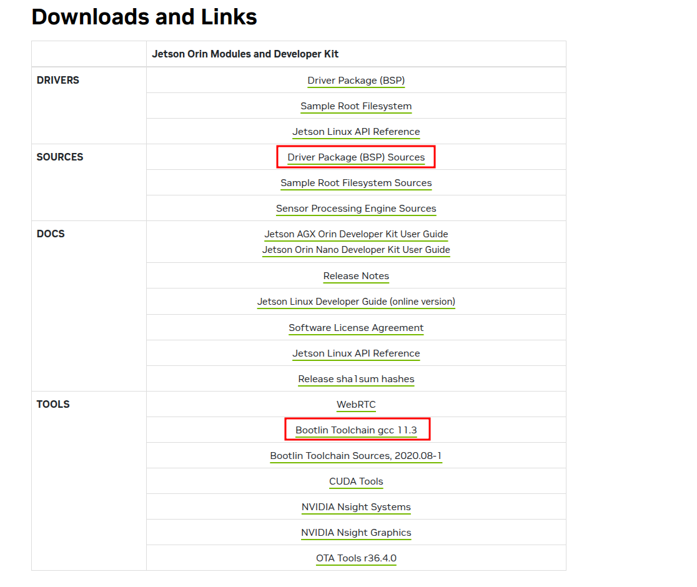

1. Download the BSP source code and the compilation toolchain separately.

- Download `Driver Package (BSP) Sources` to get `public_sources.tbz2`
- Download `Bootlin Toolchain gcc 11.3` to get `aarch64--glibc--stable-2022.08-1.tar.bz2`

2. Set up the compilation environment

```bash
mkdir -p nvidia_devicetree
cd nvidia_devicetree

# Add your downloaded files to the current directory
# Be sure to replace `you_download_folder` with your actual download directory; do not copy this exactly
cp -r ~/you_download_folder/public_sources.tbz2 .
cp -r ~/you_download_folder/aarch64--glibc--stable-2022.08-1.tar.bz2 .

# Extract these two files
tar -xjvf public_sources.tbz2
tar -xjvf aarch64--glibc--stable-2022.08-1.tar.bz2

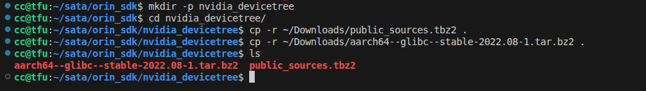
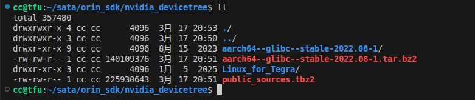

3. Extract the source code part

```bash
cd you_kernel_ws/Linux_for_Tegra/source

# Extract the following three main components; all are crucial and indispensable
tar -xjvf kernel_src.tbz2
tar -xjvf kernel_oot_modules_src.tbz2 
tar -xjvf nvidia_kernel_display_driver_source.tbz2

```

|   |   |
|---|---|
|`kernel_src.tbz2`|Linux kernel mainline source code|
|`kernel_oot_modules_src.tbz2`|NVIDIA Out-Of-Tree (OOT) kernel module source code|
|`nvidia_kernel_display_driver_source.tbz2`|NVIDIA display driver source code|


### Add Build Toolchain Links and Environment Variables

1. Download the corresponding compilation toolchain based on your operating platform

```bash
# When operating on an AMD (x86) host, download the tool
sudo apt-get install device-tree-compiler 
# When operating on a Jetson board, download the tool
sudo apt install tegra-21x-dt   
sudo apt-get install libssl-dev        
```

2. Add the compilation toolchain link in the current terminal
```bash
# Change directory to you_kernel_ws
cd ~/you_kernel_ws/Linux_for_Tegra/source

# Be sure to replace `you_kernel_ws` with your actual working directory; do not copy this exactly
export CROSS_COMPILE_AARCH64_PATH=~/you_kernel_ws/aarch64--glibc--stable-2022.08-1
export CROSS_COMPILE=~/you_kernel_ws/aarch64--glibc--stable-2022.08-1/bin/aarch64-buildroot-linux-gnu-
```
3. Set the build script for real-time configuration
```bash
./generic_rt_build.sh "enable"
```

*Example:*
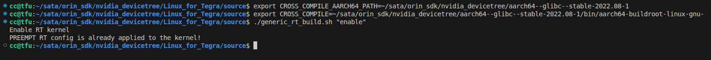

### Modify the Device Tree
1. Modify the UART section

    **In`you_kernel_ws/Linux_for_Tegra/source/hardware/nvidia/t23x/nv-public/tegra234-p3768-0000.dtsi`,modify the following sections**

- Add the mapping for`serial3`in the`aliases`node
```c
	aliases {
		// serial0 = &tcu;
		// serial1 = &tcu;
		// serial2 = &tcu;
		
		/* Add the following three lines to remap the UARTs */
		serial1 = &uarta;
		serial2 = &uarte;
		serial3 = "/bus@0/serial@3110000";		// This line maps the UART corresponding to 3110000 to ttyTHS3
	};
```
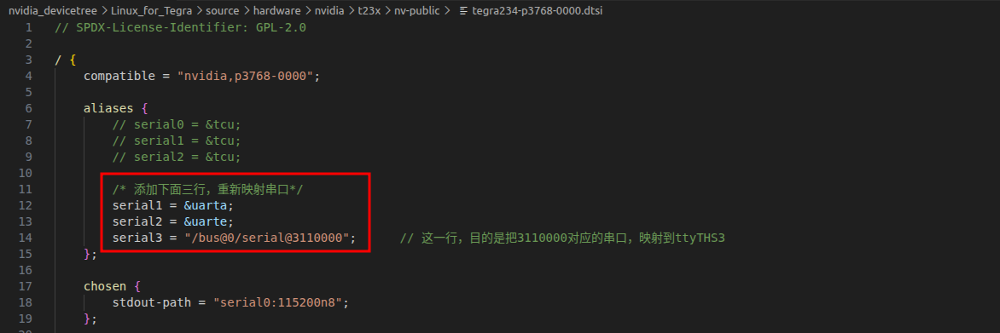

- Add the`serial@3110000`section after the `serial@31d0000` node and enable the UART
```c
serial@31d0000 {
			current-speed = <115200>;
			status = "okay";
		};

		/* Add UART1 corresponding to physical UART0 on the carrier board */
		serial@3110000 {/* Enable UART1 */
			status = "okay";
		};
```

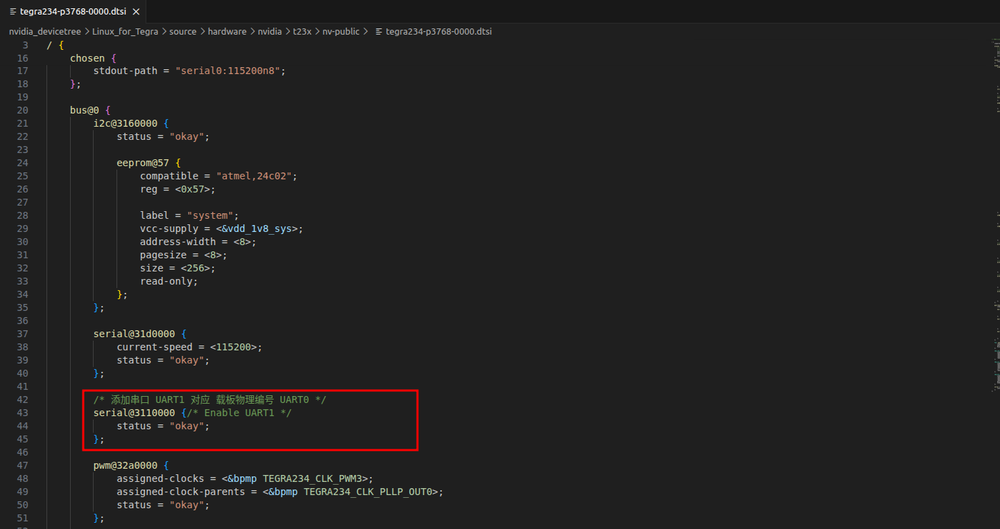


2. Modify the USB3.0 section

- Under`padctl@3520000 --> usb3 --> lanes`, add the `usb3-2`part to configure the third USB 3.0 lane
```c
usb3 {
					lanes {
						usb3-0 {
							nvidia,function = "xusb";
							status = "okay";
						};

						usb3-1 {
							nvidia,function = "xusb";
							status = "okay";
						};

						/* Add USB2 PHY lane configuration */
						usb3-2 {		// Third USB 3.0 lane
							nvidia,function = "xusb";
							status = "okay";
						};
					};
				};
```

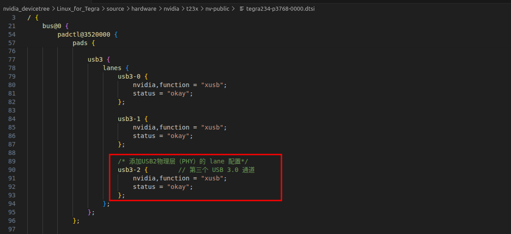

- Under`padctl@3520000 --> ports`, add the `usb3-2`part to activate the third USB 3.0 port

```c
			ports {
				/* recovery port */
				usb2-0 {
					mode = "otg";
					vbus-supply = <&vdd_5v0_sys>;
					status = "okay";
					usb-role-switch;
				};

				/* hub */
				usb2-1 {
					mode = "host";
					vbus-supply = <&vdd_1v1_hub>;
					status = "okay";
				};

				/* M.2 Key-E */
				usb2-2 {
					mode = "host";
					vbus-supply = <&vdd_5v0_sys>;
					status = "okay";
				};

				/* hub */
				usb3-0 {
					nvidia,usb2-companion = <1>;
					status = "okay";
				};

				/* J5 */
				usb3-1 {
					nvidia,usb2-companion = <0>;
					status = "okay";
				};

				/* Add usb3-2 part to enable USB3.0 */
				usb3-2 {
					nvidia,usb2-companion = <2>;		// "2" is the pairing identifier indicating that usb3-2 lane pairs with usb2-2 lane
					status = "okay";
				};
			};
```

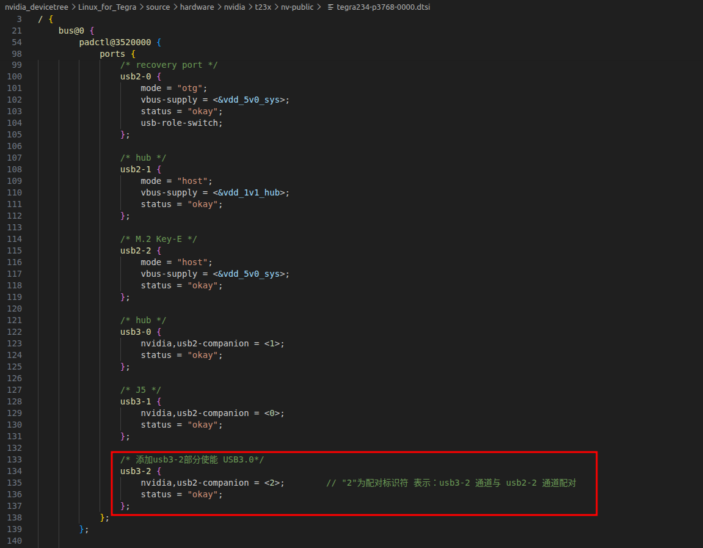

- Connect the added enabled hardware lanes to the USB controller

```c
		usb@3610000 {
			status = "okay";

			phys = <&{/bus@0/padctl@3520000/pads/usb2/lanes/usb2-0}>,
			       <&{/bus@0/padctl@3520000/pads/usb2/lanes/usb2-1}>,
			       <&{/bus@0/padctl@3520000/pads/usb2/lanes/usb2-2}>,
			       <&{/bus@0/padctl@3520000/pads/usb3/lanes/usb3-0}>,
			       <&{/bus@0/padctl@3520000/pads/usb3/lanes/usb3-1}>,
				   <&{/bus@0/padctl@3520000/pads/usb3/lanes/usb3-2}>;		// Add this line to mount usb3-2 onto the usb3.0 bus
			phy-names = "usb2-0", "usb2-1", "usb2-2", "usb3-0","usb3-1","usb3-2";		// Add usb3-2 to mark it on the bus for internal driver use
		};
```
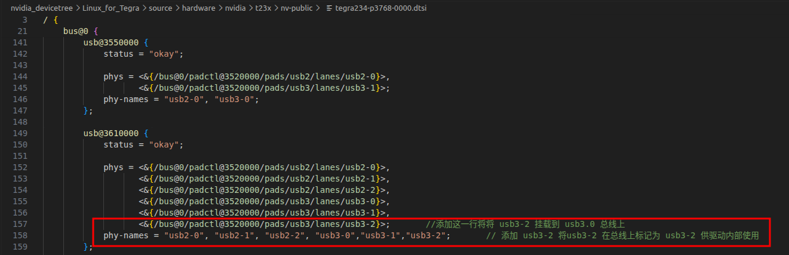

### Compile the Kernel and Device Tree

1. Compile the kernel
```bash
# Enter Linux_for_Tegra/source
cd ~/you_kernel_ws/Linux_for_Tegra/source
# Set environment variables
export CROSS_COMPILE_AARCH64_PATH=~/you_kernel_ws/aarch64--glibc--stable-2022.08-1
export CROSS_COMPILE=~/you_kernel_ws/aarch64--glibc--stable-2022.08-1/bin/aarch64-buildroot-linux-gnu-

make -C kernel

```
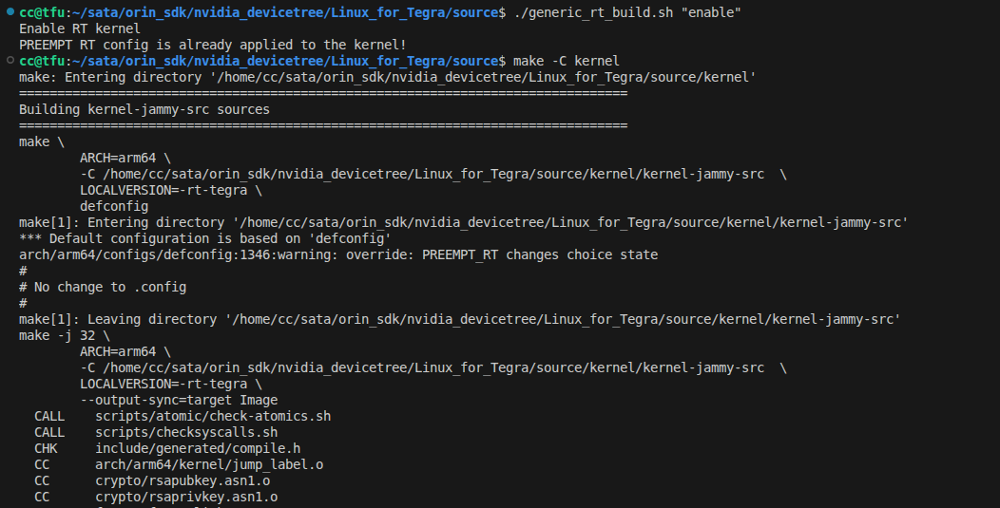

2. Compile modules

```bash
# Set environment variables
# export CROSS_COMPILE_AARCH64_PATH=~/you_kernel_ws/aarch64--glibc--stable-2022.08-1
# export CROSS_COMPILE=~/you_kernel_ws/aarch64--glibc--stable-2022.08-1/bin/aarch64-buildroot-linux-gnu-
export IGNORE_PREEMPT_RT_PRESENCE=1
export KERNEL_HEADERS=~/you_kernel_ws/Linux_for_Tegra/source/kernel/kernel-jammy-src/

# Compile modules
make modules
```

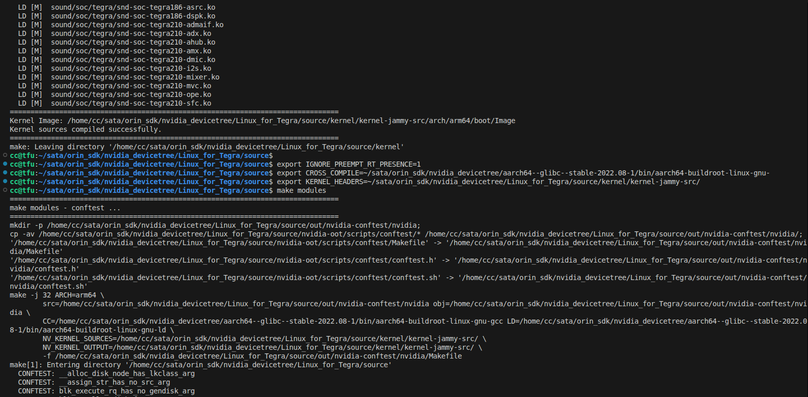


3. Compile the device tree
```bash
# Set environment variables
# export CROSS_COMPILE_AARCH64_PATH=~/you_kernel_ws/aarch64--glibc--stable-2022.08-1
# export CROSS_COMPILE=~/you_kernel_ws/aarch64--glibc--stable-2022.08-1/bin/aarch64-buildroot-linux-gnu-
export IGNORE_PREEMPT_RT_PRESENCE=1
export KERNEL_HEADERS=~/you_kernel_ws/Linux_for_Tegra/source/kernel/kernel-jammy-src/

# Compile device tree
make dtbs
```

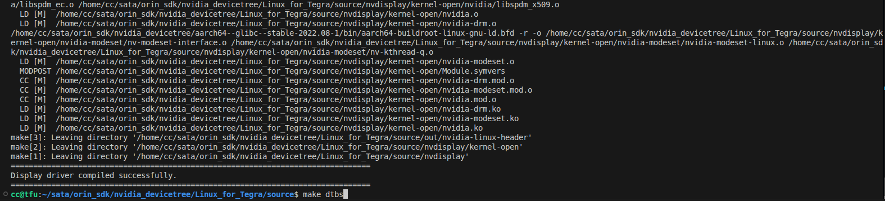

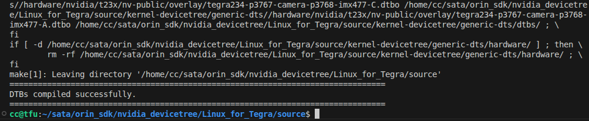

4. Check the generated device tree file
- Typically, the generated device tree file is located in `Linux_for_Tegra/source/kernel-devicetree/generic-dts/dtbs`

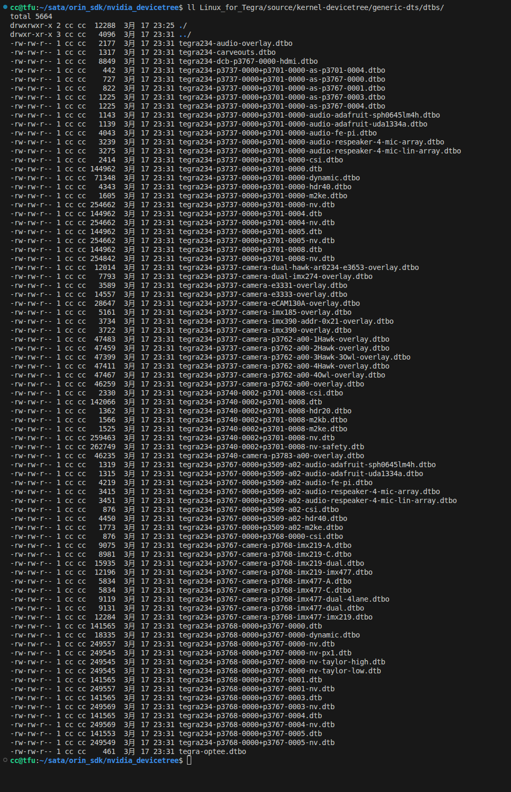
```bash
cd ~/you_kernel_ws

ll Linux_for_Tegra/source/kernel-devicetree/generic-dts/dtbs/
```


### Replace the Device Tree on the Board and Specify the Device Tree Loaded During Kernel Boot

1. Replace the device tree on the Jetson Orin board

- Upload the generated`.dtb`file to the Jetson Orin board

```bash
scp -r ~/you_kernel_ws/tegra234-p3768-0000+p3767-0000-nv.dtb ssh ubuntu@example.com：~/
```

- On the Orin board, copy the obtained file to`/boot/dtb/`
```bash
sudo cp -r ~/tegra234-p3768-0000+p3767-0000-nv.dtb /boot/dtb/
```

2. Manually specify the device tree file (.dtb) path used by the bootloader (U-Boot) when starting the kernel
- Add the following content to`/boot/extlinux/extlinux.conf`on the Jetson Orin board

```bash
TIMEOUT 30
DEFAULT primary

MENU TITLE L4T boot options

LABEL primary
      MENU LABEL primary kernel
      # Add the line below to specify the corresponding dtb file. Modify the filename based on your actual situation. You can check with ls /boot/dtb
      # FDT /boot/dtb/kernel_tegra234-p3768-0000+p3767-0000-nv-super.dtb
      FDT /boot/dtb/tegra234-p3768-0000+p3767-0000-nv.dtb
      LINUX /boot/Image
      INITRD /boot/initrd
      APPEND ${cbootargs} root=PARTUUID=d80a7554-de4f-4a6e-8b9d-26c324a07bb8 rw rootwait rootfstype=ext4 mminit_loglevel=4 console=ttyTCU0,115200 firmware_class.path=/etc/firmware fbcon=map:0 video=efifb:off console=tty0

```
3. After completing the above steps, restart the Jetson Orin board

### Test if USB and UART are Enabled
- Insert a device with a speed >= USB 3.0 and check the output of `lsusb -t` in the command line
```bash
lsusb 
lsusb -t
```

- Check if all serial ports have been listed

```bash
# Is ttyTHS3 listed (this is the serial port that we have enabled)?
ls /dev/ttyTHS*
```

```log
nn@ubuntu:~$ lsusb 
Bus 002 Device 009: ID 30de:6544 KIOXIA TransMemory     # Identified the USB3Gen2 mobile storage unit
Bus 002 Device 007: ID 05e3:0625 Genesys Logic, Inc. USB3.2 Hub
Bus 002 Device 001: ID 1d6b:0003 Linux Foundation 3.0 root hub
Bus 001 Device 005: ID 8087:0a2b Intel Corp. Bluetooth wireless interface
Bus 001 Device 015: ID 05e3:0610 Genesys Logic, Inc. Hub
Bus 001 Device 006: ID 046d:c52b Logitech, Inc. Unifying Receiver
Bus 001 Device 003: ID 1a40:0101 Terminus Technology Inc. Hub
Bus 001 Device 001: ID 1d6b:0002 Linux Foundation 2.0 root hub
nn@ubuntu:~$ lsusb -t
/:  Bus 02.Port 1: Dev 1, Class=root_hub, Driver=tegra-xusb/4p, 10000M
    |__ Port 1: Dev 10, If 0, Class=Hub, Driver=hub/4p, 10000M
        |__ Port 4: Dev 11, If 0, Class=Mass Storage, Driver=usb-storage, 5000M     # It was connected to the USB 3.0 bus at a speed of 500 Mbps.
/:  Bus 01.Port 1: Dev 1, Class=root_hub, Driver=tegra-xusb/4p, 480M
    |__ Port 2: Dev 17, If 0, Class=Hub, Driver=hub/4p, 480M
    |__ Port 3: Dev 3, If 0, Class=Hub, Driver=hub/4p, 480M
        |__ Port 1: Dev 6, If 1, Class=Human Interface Device, Driver=usbhid, 12M
        |__ Port 1: Dev 6, If 2, Class=Human Interface Device, Driver=usbhid, 12M
        |__ Port 1: Dev 6, If 0, Class=Human Interface Device, Driver=usbhid, 12M
        |__ Port 4: Dev 5, If 0, Class=Wireless, Driver=btusb, 12M
        |__ Port 4: Dev 5, If 1, Class=Wireless, Driver=btusb, 12M
nn@ubuntu:~$
nn@ubuntu:~$
nn@ubuntu:~$ ls /dev/ttyTHS*
/dev/ttyTHS0  /dev/ttyTHS1  /dev/ttyTHS3		# Among them, "/ttyTHS3" is the one that we manually enabled.
nn@ubuntu:~$ 

```

**When your device can be connected to the USB 3.0 bus, all your serial ports are present and available. This indicates that our work has been successful!**

- At this point, your configuration work is basically completed. If you encounter any problems during use, please submit an issue on Gitee. We will handle it for you as soon as possible. Please keep an eye on the progress of your issue and do not submit the same issue again (as someone else raised a similar issue before). 
- Thank you for using the products of DaMiao Technology. We wish you a happy life and work!