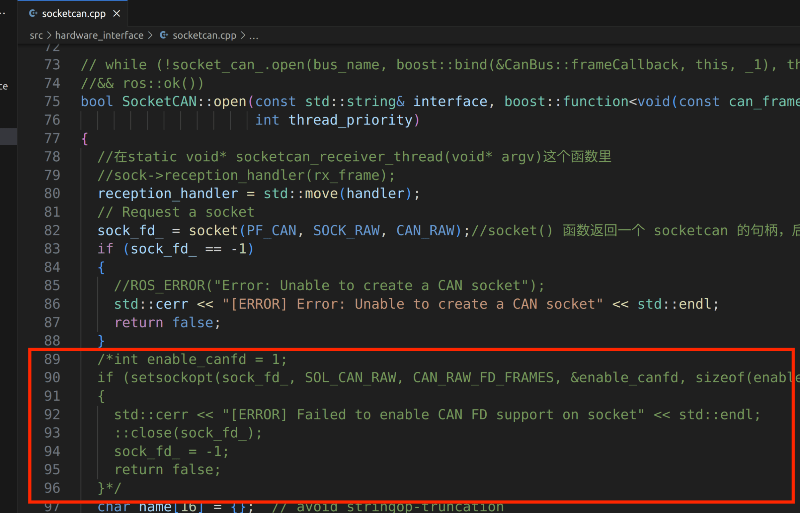

# orin-control

### 介绍
可以直接使用达妙orin载板上的can接口控制dm电机

也可以使用任意的can设备控制达妙电机

程序默认运行的效果是让canid为0x01、mstid为0x11、控制模式为mit模式的**波特率为1M**的DM4310电机按sin速度旋转

程序支持**CANFD 5M波特率**

### 软件架构
使用c++语言，没有用到ros


### 安装和编译

- 安装CMake
```shell
sudo apt update
sudo apt install cmake
```
- 安装can工具
```shell
sudo apt install can-utils
```
- 下载并且编译该程序
1. 创建一个工作空间并且克隆该程序：
```shell
mkdir -p ~/orin_ws/src
cd ~/orin_ws/src
git clone https://gitee.com/xauter/orin-control.git
```
2. 编译：
```shell
cd ~/orin_ws/src/orin-control/dm_hw
mkdir build
cd build
cmake ..
make
```

### 使用

1. 首先检查can设备，打开一个终端，输入：
```shell
ip -brief link | grep can
```
如果没有输出，就输入下面指令，加载内核模块：
```shell
sudo modprobe mttcan
```
然后再检查can设备。

2. 然后输入：
```shell
sudo ip link set can0 up type can bitrate 1000000
candump can0
```
第一行命令是开启can0并且设置波特率1M，

第二行命令是实时监听并打印 CAN 总线（can0 接口）上收到的所有 CAN 报文。

3. 执行

在你刚刚编译的build文件夹中打开终端运行dm_main文件：
```shell
cd ~/orin_ws/src/orin-control/dm_hw/build
./dm_main
```
此时你会发现电机亮绿灯，并且以sin速度旋转，同时终端会打印电机返回的位置速度力矩。

4. 使用5M波特率

首先，取消src文件夹的socketcan.cpp里的一段注释，如下所示：
 



然后重新编译该程序：
```shell
cd ~/orin_ws/src/orin-control/dm_hw/build
make
```

如果你刚刚使用can设备，则需要先关闭can设备：

```shell
sudo ip link set can0 down
```

然后给can设备设置仲裁域1M波特率、数据域5M波特率：

```shell
sudo ip link set can0 type can bitrate 1000000 dbitrate 5000000 fd on
candump can0
```

接着在你刚刚编译的build文件夹中打开终端运行dm_main文件：
```shell
cd ~/orin_ws/src/orin-control/dm_hw/build
./dm_main
```
此时你会发现电机亮绿灯，并且以sin速度旋转，同时终端会打印电机返回的位置速度力矩。


