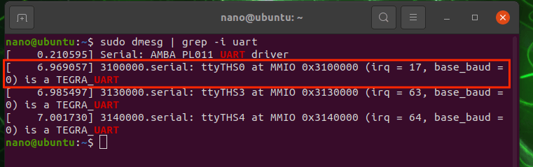
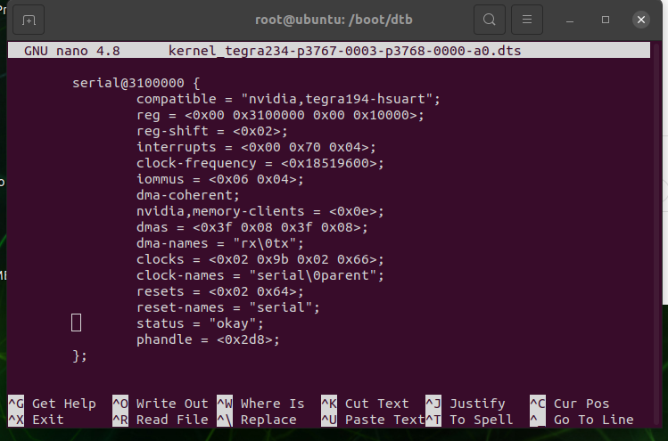
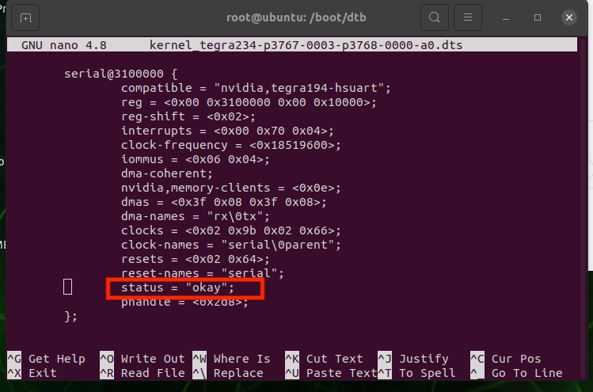
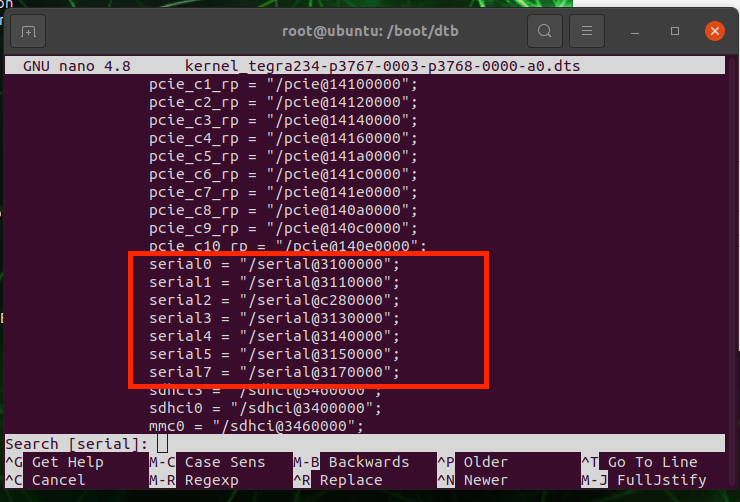
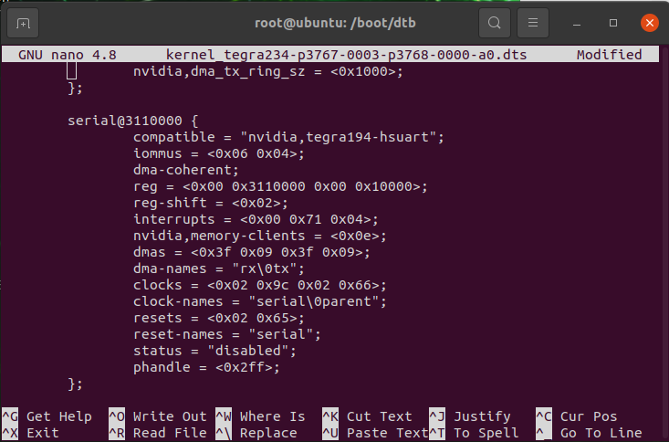
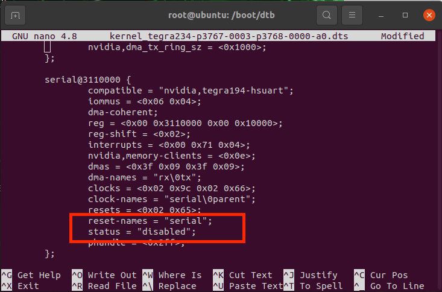
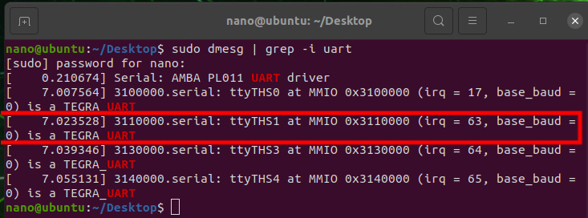
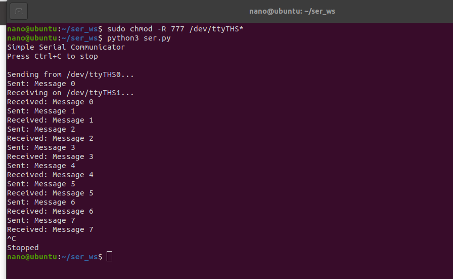

# 达妙orin载板使能uart0和uart1方法

## 介绍

***注意系统上的serial01和达妙orin载板上的串口01是反了，下面会提到***

以orin nano为例，手把手教你使能达妙orin载板上uart0和uart1方法。

刷机后载板上的uart1默认开启。

## 步骤

1. 首先打开终端检查serial设备
```shell
sudo dmesg | grep -i uart
```


上面的ttyTHS0就是载板上的uart1(刚好反了)，出现这个说明uart1使能了。

2. 然后查看并且修改设备树

先安装设备树编译器：
```shell
sudo apt-get install device-tree-compiler
```
验证是否安装成功 dtc -v

然后反编译设备树文件(.dtb)(先备份好),将/boot/dtb/文件夹中的.dtb文件复制到外边单独一个目录，然后在该目录打开终端

切换到root用户
```shell
sudo su
```
然后反编译设备树文件
***注意A是你的设备树文件名***
```shell
dtc -I dtb -O dts A.dtb > A.dts
```
***注意A是你的设备树文件名***

然后打开A.dts：
```shell
nano A.dts
```
然后按键盘的ctrl+w搜索关键字“serial”，我的会出现如下：





可以看到这个serial@3100000就是对应的上面的ttyTHS0，也就是orin载板上的uart1，然后他的status=“okay”，说明他使能了。

接下来我们要使能orin载板上的uart0，他对应的是ttyTHS1。

继续按键盘的ctrl+w搜索关键字“serial”，我的会出现如下：



可以看到serial1（orin载板上的uart0）对应的是serial@3110000。

继续按键盘的ctrl+w搜索关键字“serial”，搜索到serial@3110000：





他的status="disable"，这时候需要把disable改成okay。还有reset-names="serial"。

然后退出A.dts文件。

然后编译设备树：
```shell
dtc -I dts -O dtb A.dts > A.dtb
```
再将新的设备树文件替换掉/boot/dtb/文件夹中原有的设备树文件。

重启。

3. 打开终端检查serial设备
```shell
sudo dmesg | grep -i uart
```


发现有ttyTHS1，说明orin载板上的串口0使能了。

4. 测试

先给串口0和串口1设置权限。
```shell
sudo chmod -R 777 /dev/ttyTHS*
```
用4pin线将串口0和串口1连在一起，然后运行如下脚本:
```shell
import serial
import threading
import time

# Basic configuration
SEND_PORT = '/dev/ttyTHS0'
RECEIVE_PORT = '/dev/ttyTHS1'
BAUDRATE = 9600

def send_data():
    try:
        # Setup serial port
        with serial.Serial(SEND_PORT, BAUDRATE, timeout=1) as ser:
            print(f"Sending from {SEND_PORT}...")
            count = 0
            
            while True:
                # Send simple message
                msg = f"Message {count}\n"
                ser.write(msg.encode())
                print(f"Sent: {msg.strip()}")
                count += 1
                time.sleep(1)
                
    except Exception as e:
        print(f"Send error: {e}")

def receive_data():
    try:
        # Setup serial port
        with serial.Serial(RECEIVE_PORT, BAUDRATE, timeout=1) as ser:
            print(f"Receiving on {RECEIVE_PORT}...")
            
            while True:
                # Read incoming data
                if ser.in_waiting:
                    data = ser.readline().decode().strip()
                    print(f"Received: {data}")
                time.sleep(0.1)
                
    except Exception as e:
        print(f"Receive error: {e}")

if __name__ == "__main__":
    print("Simple Serial Communicator")
    print("Press Ctrl+C to stop\n")
    
    # Start communication threads
    threading.Thread(target=send_data, daemon=True).start()
    threading.Thread(target=receive_data, daemon=True).start()
    
    # Keep program running
    try:
        while True:
            time.sleep(1)
    except KeyboardInterrupt:
        print("\nStopped")
    
```
出现如下说明串口0和串口1正常工作:
```shell
sudo dmesg | grep -i uart
```



